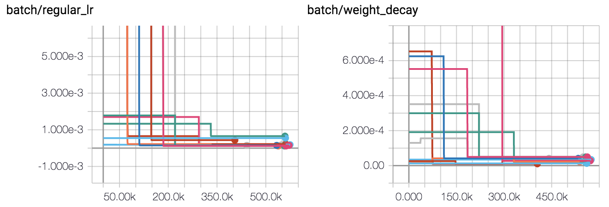

## Population-Based Training

This is a Python implementation of population-based training, as described in
[Population Based Training of Neural Networks](https://arxiv.org/abs/1711.09846) by
Jaderberg et al.



*Example training run: Evaluation metric (top) and hyperparameter values (bottom) over time
during population-based training (population size 10).*

### Usage
Clone this repository and add it to your project's source tree. Then add PBT to your project
with the following commands:

1. Start a PBT server.
    ```python
    server = PBTServer(args.port, args.auth_key, args.maximize_metric)
    ```

2. Create a PBT client:
    ```python
    pbt_client = PBTClient(args.pbt_server_url, args.pbt_server_port, args.pbt_server_key, args.pbt_config_path)
    ``` 

3. Exploit and explore: Suppose we've just written a checkpoint to `ckpt_path` and
evaluated our model, producing a score `metric_val` (*e.g.,* validation accuracy).
Then we might do the following:   
    ```python
    pbt_client.save(ckpt_path, metric_val)
    if pbt_client.should_exploit():
        # Exploit
        pbt_client.exploit()
    
        # Load model and optimizer parameters from exploited network
        model = load_model(pbt_client.parameters_path(), args.gpu_ids)
        model.train()
        load_optimizer(pbt_client.parameters_path(), gpu_ids, optimizer)
    
        # Explore
        pbt_client.explore()
    ```
    Note each step performed in the block above:
      1. `pbt_client.save`: Tell the PBT server that this client just saved a checkpoint to `ckpt_path`
      with evaluation score `metric_val`.
      2. `pbt_client.should_exploit`: Ask the PBT server if this client should exploit another model. *E.g.,* when
      using truncation selection, this is true when the client's performance ranks in the bottom 20% of the population.
      3. `pbt_client.exploit`: Ask the PBT server for a checkpoint path of a model to exploit.
      4. `load_model` and `load_optimizer`: Load the parameters and hyperparameters of the exploited model.
      5. `pbt_client.explore`: Explore the hyperparameter space. *E.g.,* when using the perturb strategy,
      multiply each hyperparameter by 0.8 or 1.2. 
